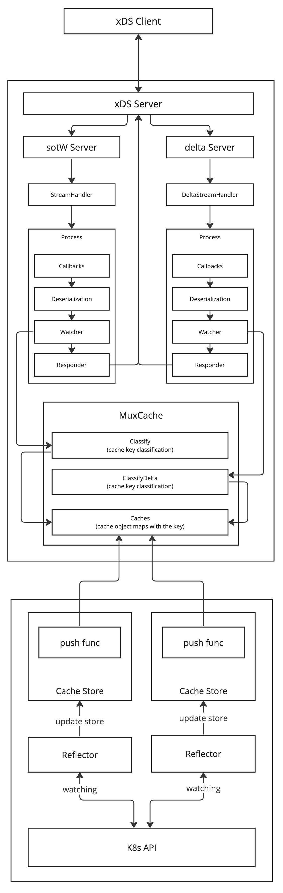

# Overview

## gRPC Client

### Bootstrap file
- set path that point to the bootstrap file by set an ENV `GRPC_XDS_BOOTSTRAP` or `GRPC_XDS_BOOTSTRAP_CONFIG`
- see [gRFC A27](https://github.com/grpc/proposal/blob/master/A27-xds-global-load-balancing.md#xdsclient-and-bootstrap-file) for the bootstrap format
- see the list of `server_features` available [here](https://github.com/grpc/grpc-go/blob/eb08be40dba28d0889f187e95cf42f3984f5f9b4/xds/internal/xdsclient/bootstrap/bootstrap.go#L53)

### Transport
- gRPC client xDS is relies on an ADS stream (not delta)

### Application Architecture

**_NOTE_**: since the gRPC client xDS relies on a non-delta ADS stream, so, the xDS management server can provide only an API for <b>SotW Server</b>