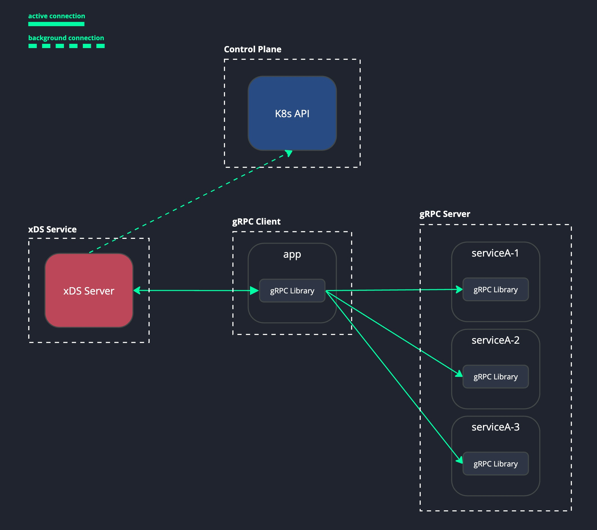
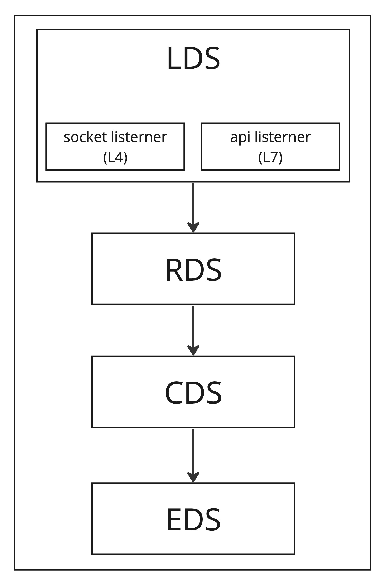
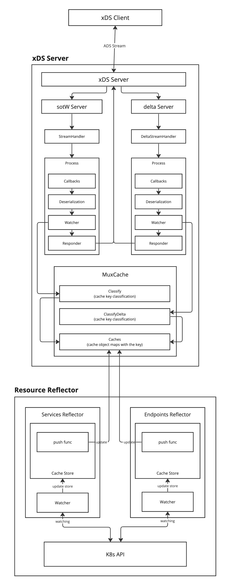
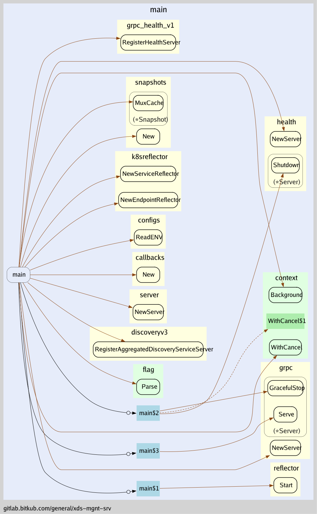
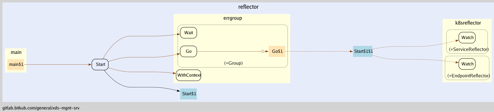
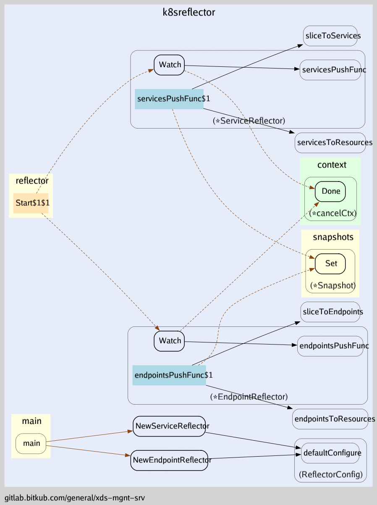

**Table of Contents**

- [Overview](#overview)
- [Glossary](#glossary)
- [Implementation](#implementation)
  - [Protocol](#protocol)
  - [Transport](#transport)
  - [Understand Envoy Structure](#understand-envoy-structure)
  - [Application Internal Workflow](#application-internal-workflow)
  - [Call Graph Overview](#call-graph-overview)
- [xDS Client](#xds-client)
  - [Example](#example)
    - [Go](#go)

<b>xDS Management Server</b>

# Overview


# Glossary
<b>xDS</b>

xDS is a suite of APIs for configuring data plane behavior, in this context, the data plane is a piece of software that handles network traffic, such as client, server, or proxy

<b>ADS</b>

Aggregated xDS uses a single REST/gRPC connection to communicate with the xDS server for the resource it intends to whether LDS, RDS, CDS, or EDS

<b>SotW</b>

is an approach that was the original mechanism used by xDS, in which the client must specify all resource names it is interested in with each request, and for LDS and CDS resources, the server must return all resources that the client has subscribed to in each request.

<b>delta</b>

 refers to the difference between the current state of an object and its previous state. This could be a change in any attribute of the object, like adding or removing a label, modifying a field value, or even deleting the object entirely.

# Implementation
## Protocol
Aggregated Discovery Service (ADS): SotW, aggregate stream for all resource types

## Transport
gRPC client that uses xDS will establish an ADS stream with non-delta which is a single TCP connection(gRPC) and separates each resource (LDS, RDS, CDS, EDS) in each channel to communicate with the xDS server. [See the implementation](https://github.com/grpc/grpc-go/blob/eb08be40dba28d0889f187e95cf42f3984f5f9b4/xds/internal/xdsclient/transport/transport.go#L269C59-L269C84)

## Understand Envoy Structure



**_NOTE_**: The APIListener is use to skip the TCP filters and goes right to the HCM config


## Application Internal Workflow


## Call Graph Overview

<p>main</p>


<p>reflector</p>


<p>k8sreflector</p>


# xDS Client
You need to set xDS bootstrap config on your application. Here's the xDS bootstrap config:
```json
{
    "xds_servers": [
        {
            "server_uri": "appname.appns:530",
            "channel_creds": [{"type": "insecure"}],
            "server_features": ["xds_v3"]
        }
    ],
    "node": {
        "id": "default",
        "locality": {
            "zone" : "k8s"
        }
    }
}
```
Set the `server_uri` to wherever your client application can access the xDS server. There are 2 available methods to supply the xDS bootstrap config:
- Put the JSON content in a file, then point `GRPC_XDS_BOOTSTRAP` environment variable to the path of the file
- Put the JSON content in `GRPC_XDS_BOOTSTRAP_CONFIG` environment variable
---
## Example
### Go
```go
package main

import (
    "google.golang.org/grpc/credentials/insecure"
    "google.golang.org/grpc"
    // xdsresolver
    _ "google.golang.org/grpc/xds"

)
func main(){
    ...

    // target must matched with the LDS resource
    target := "xds:///xds.info"
    grpcClientConn, err := grpc.NewClient(target, grpc.WithTransportCredentials(insecure.NewCredentials()))

    ...
```
or see an example application on [example-go-xdsclient](https://github.com/sifer169966/go-grpc-lb-lab/tree/master/xdsclient)
